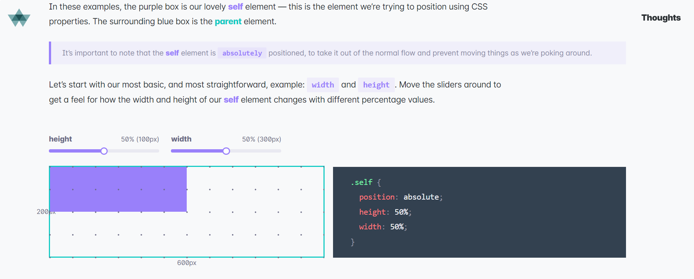

## CSS

#### Framework

+ [Bootstrap](https://getbootstrap.com/)
  - [React Bootstrap](https://react-bootstrap.github.io/)
  
+ [Animate CSS](http://www.cssportal.com/animate-css/)
> CSS 動畫函式庫

#### Online Tools

+ [Text Setting](http://csstypeset.com/)
+ [Pixels to EM](http://pxtoem.com/)
+ [Drawter](http://drawter.com/)
+ [CSS3 Maker](http://www.css3maker.com/)

#### 教學與說明

[What does 100% mean in CSS?](https://wattenberger.com/blog/css-percents)
> 解釋不同 position 下的長寬比例與位置對準

#### 樣式開發者

+ [Sarah L. Fossheim](https://codepen.io/collection/nwzQJq?cursor=ZD0wJm89MSZwPTEmdj01Mzg4Njg1)
    - [推薦文章](https://www.facebook.com/groups/f2e.tw/permalink/3076339755736702/)

+ [Julia Evans](https://wizardzines.com/comics/)
   - [推薦文章](https://www.facebook.com/groups/f2e.tw/permalink/3068945923142752/)
   - [Twitter](https://twitter.com/b0rk?s=20)

